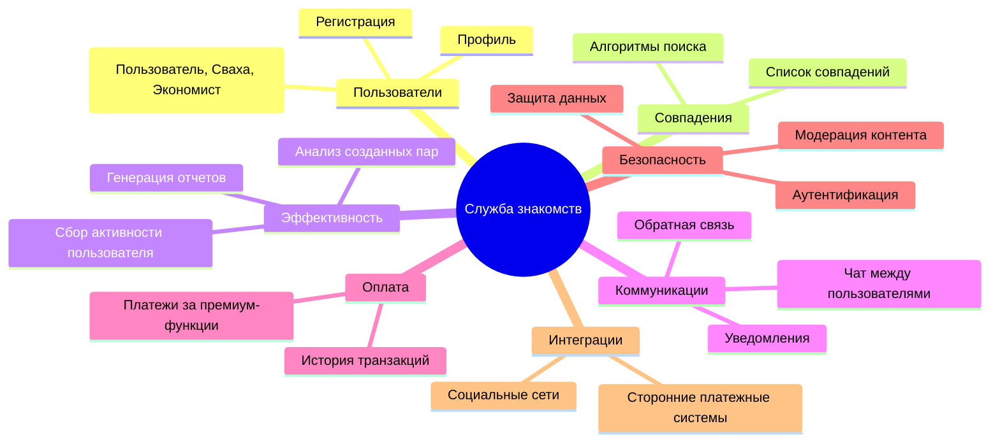
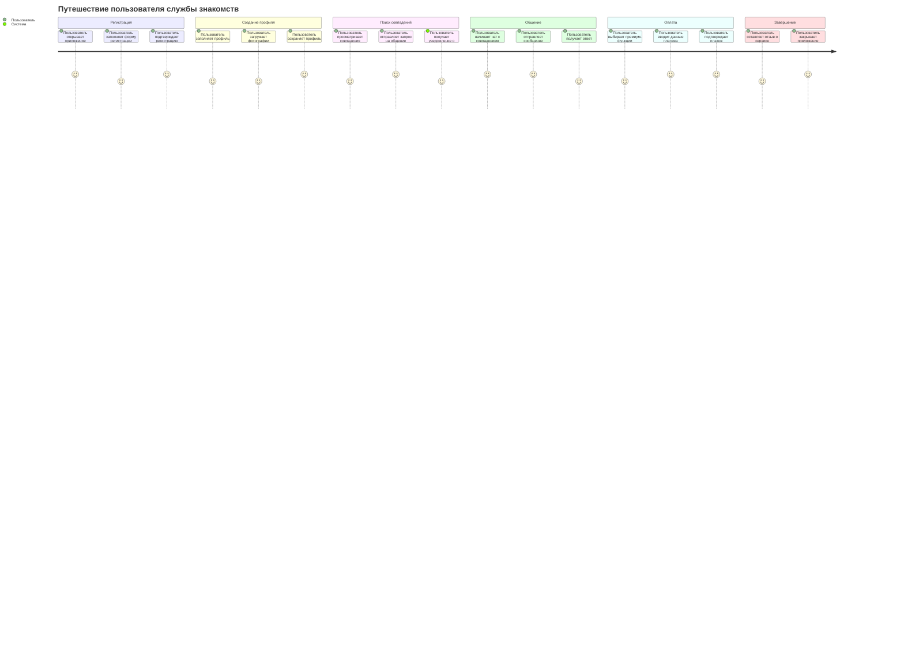
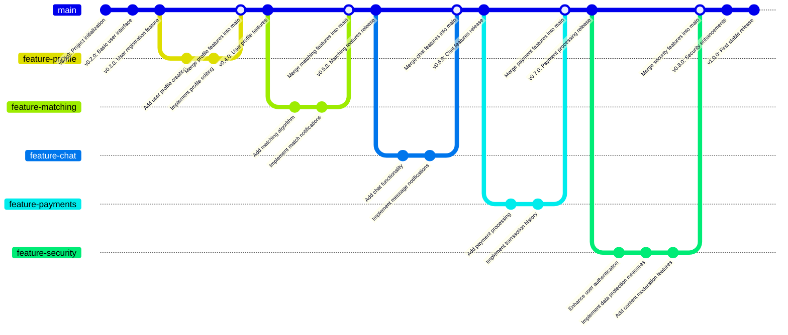

# Документирование приложения для Службы знакомств

## 1. Структура функциональных возможностей (Mind Map)



### Описание:

Эта диаграмма иллюстрирует структуру функциональных возможностей приложения.

## Основные узлы и их значение:

* <u>Пользователи:</u> функционал, связанный с управлением учетными записями, профилями и рейтингами.

* <u>Защита данных:</u> безопасность приложения.

* <u>Интеграции:</u> описывает процессы, связанные с интергацией сторонниъ систем общения.

* <u>Коммуникации:</u> система взаимодействия между пользователями (чаты, уведомления).


## 2. Диаграмма путешествия пользователя (User Journey Diagram)

### Описание:

Диаграмма описывает ключевые этапы взаимодействия пользователя с системой:

* Регистрация: пользователь данные для входа и проходит аунтефикацию

* Создание профиля: пользователь создания профиля.

* Поиск совпадений: поиск совпадений среди других пользователей

* Общение: общение пользователей между собой.

* Оплата: оплата платных функкий (в случае использования)


## 3. Квадрант-граф (Prioritization Quadrant)

```mermaid
quadrantChart

    title Приоритеты разработки функциональности

    x-axis Easy --> Hard

    y-axis Low Priority --> High Priority

    "Регистрация": [0.8, 0.7]

    "Создание профиля": [0.20, 0.74]

    "Поиск совпадений": [0.5, 0.85]

    "Чат между пользователями": [0.6, 0.8]

    "Уведомления о совпадениях": [0.4, 0.7]

    "Платежи за премиум-функции": [0.7, 0.9]

    "Обратная связь": [0.5, 0.6]

    "Модерация контента": [0.15, 0.9]

    "Аутентификация": [0.4, 0.9]

    "Защита данных": [0.6, 0.9]

    "Интеграция с социальными сетями": [0.3, 0.3]
```
Квадрант-граф помогает приоритизировать разработку функций системы. Каждая точка соответствует функционалу:

* Ось X: сложность реализации (от простого к сложному).

* Ось Y: приоритет для пользователей (от низкого к высокому).


# 4. Гит граф (Gitgraph)



### Описание:

 Гит-граф показывает процесс разработки системы через версии:

1. Основная ветка (main): стабильные версии системы.

2. Функциональные ветки: каждая ветка посвящена отдельной функциональности.

3. Слияния: после завершения работы над веткой, изменения интегрируются в main.
