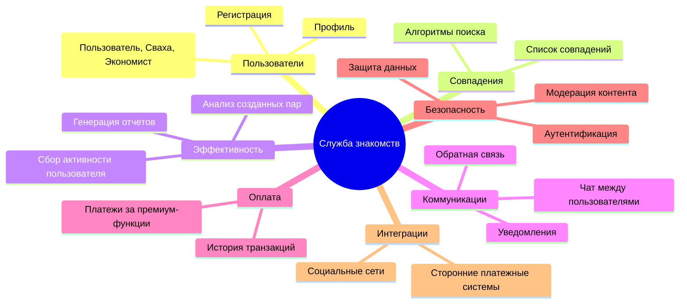
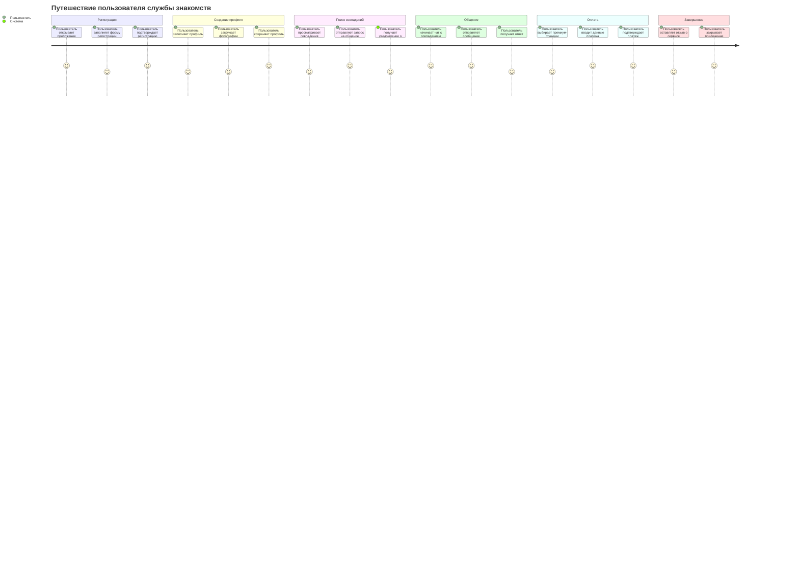
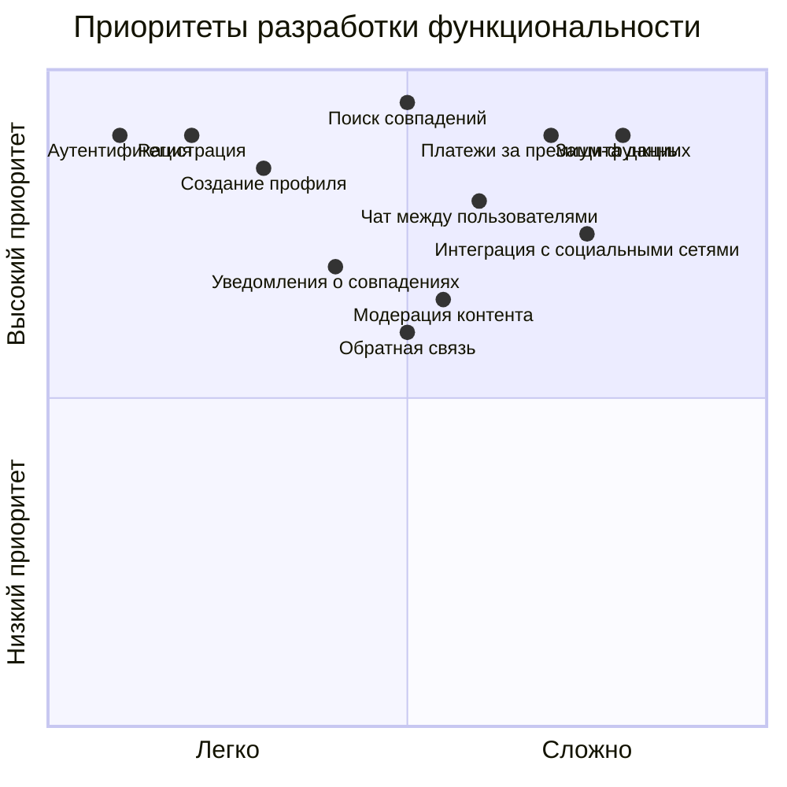

# Документирование приложения для дистанционного изучения английского языка

## 1. Структура функциональных возможностей (Mind Map)

```mermaid
mindmap
  root((Служба знакомств))
    Пользователи
      Регистрация
      Профиль
      Роли (Пользователь, Сваха, Экономист)
    Совпадения
      Алгоритмы поиска
      Список совпадений
    Эффективность
      Сбор активности пользователя
      Анализ созданных пар
      Генерация отчетов
    Коммуникации
      Чат между пользователями
      Уведомления
      Обратная связь
    Оплата
      Платежи за премиум-функции
      История транзакций
    Безопасность
      Аутентификация
      Защита данных
      Модерация контента
    Интеграции
      Социальные сети
      Сторонние платежные системы
```

```mermaid
journey
    title Путешествие пользователя службы знакомств
    section Регистрация
      Пользователь открывает приложение: 5: Пользователь
      Пользователь заполняет форму регистрации: 4: Пользователь
      Пользователь подтверждает регистрацию: 5: Пользователь
    section Создание профиля
      Пользователь заполняет профиль: 4: Пользователь
      Пользователь загружает фотографии: 4: Пользователь
      Пользователь сохраняет профиль: 5: Пользователь
    section Поиск совпадений
      Пользователь просматривает совпадения: 4: Пользователь
      Пользователь отправляет запрос на общение: 5: Пользователь
      Пользователь получает уведомление о новом совпадении: 4: Система
    section Общение
      Пользователь начинает чат с совпадением: 5: Пользователь
      Пользователь отправляет сообщение: 5: Пользователь
      Пользователь получает ответ: 4: Пользователь
    section Оплата
      Пользователь выбирает премиум-функции: 4: Пользователь
      Пользователь вводит данные платежа: 5: Пользователь
      Пользователь подтверждает платеж: 5: Пользователь
    section Завершение
      Пользователь оставляет отзыв о сервисе: 4: Пользователь
      Пользователь закрывает приложение: 5: Пользователь
```
## 3. Квадрант-граф (Prioritization Quadrant)

```mermaid
quadrantChart

title Приоритеты разработки функциональности

    x-axis Легко --> Сложно

    y-axis Низкий приоритет --> Высокий приоритет

    "Регистрация": [0.2, 0.9]

    "Создание профиля": [0.3, 0.85]

    "Поиск совпадений": [0.5, 0.95]

    "Чат между пользователями": [0.6, 0.8]

    "Уведомления о совпадениях": [0.4, 0.7]

    "Платежи за премиум-функции": [0.7, 0.9]

    "Обратная связь": [0.5, 0.6]

    "Модерация контента": [0.55, 0.65]

    "Аутентификация": [0.1, 0.9]

    "Защита данных": [0.8, 0.9]

    "Интеграция с социальными сетями": [0.75, 0.75]
```
